# Recursividade
- [Recursividade](#recursividade)
- [1. Introdução](#1-introdução)
  - [1.1 Consumo de Memória](#11-consumo-de-memória)
- [2. Dividir para Conquistar](#2-dividir-para-conquistar)
- [3. Análise de Complexidade](#3-análise-de-complexidade)

# 1. Introdução
Imagine que você queria calcular a sequência do número de Fibonacci.  
Essa sequência é dada da seguinte forma:    
  
  
 +

Note que a função 'fib' acima necessita dela mesma para calcular seu valor, até que um valor base para x seja atingido, neste caso o valor base é 0 e 1.  
Então a função para calcular a sequência chamaria a si mesma até que n chegue nos casos base.  
**Definição:** Recursividade é quando uma função, dentro de seu escopo, chama a si mesma.  
- *Recursão Direta* é quando uma função _foo_ chama a própria função _foo_.  
- *Recursão Indireta* é quando uma função _foo_ chama uma função _bar_ que, por sua vez, chama a função _foo_ novamente.

Toda função recursiva deve ter uma condição de parada que previne um loop infinito.  
Ex.: , para  0">, onde a cada passo, x descresce até que ele chegue a zero.  

## 1.1 Consumo de Memória
Para cada chamada de função, recursiva ou não, os parâmetros são e as variáveis locais são empilhados na pilha de execução. Isso implica em uma maior consumo de memória.  

Internamente, quando a função é chamada, é criado um **Registro de ativação** na pilha de execução do programa. Esse registro armazena os parâmetros e as variáveis locais, bem como o ponto de retorno da função.

Ao final da execução desse função o registro é desempilhado e a execução volta ao subprograma que chamou a função.

*Qual a diferença entre as duas execuções acima?*  
A complexidade de tempo em fibonacci recursivo é **_O(n_)**, como veremos na seção de Análise de Complexidade. Mas a complexidade de espaço também é **_O(n)_** devido a pilha de execução.

# 2. Dividir para Conquistar

# 3. Análise de Complexidade